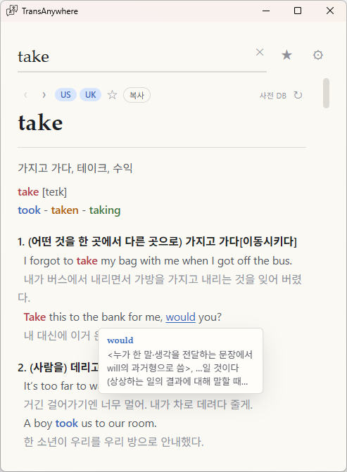
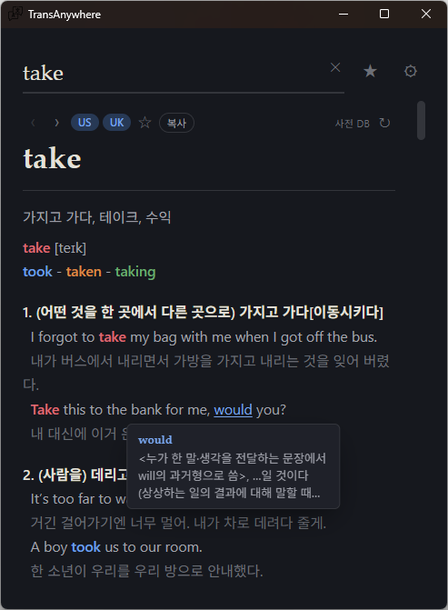
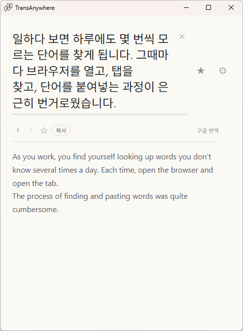

<div align="center">


# TransAnywhere

단축키 하나로 어느 창에서든 단어를 찾아보려고 만든 작은 데스크톱 사전 앱입니다.

[](https://github.com/verlane/trans-anywhere-tauri/releases)
[](https://tauri.app/)
[](https://react.dev/)
[](https://www.rust-lang.org/)

</div>

---

## 왜 만들었나

일하다 보면 하루에도 몇 번씩 모르는 단어를 찾게 됩니다. 그때마다 브라우저를 열고, 탭을
찾고, 단어를 붙여넣는 과정이 은근히 번거로웠습니다. 예전에는 AutoHotkey로 만든 도구를
썼는데, 손볼수록 구조가 버거워져서 아예 처음부터 다시 만들기로 했습니다.

그래서 목표는 단순했습니다. **어느 창에 있든 단축키 한 번으로 사전 결과가 바로 뜨고,
한 번 찾은 단어는 다음엔 네트워크 없이 즉시 나오는 것.** TransAnywhere는 그 v1 AutoHotkey
도구를 Tauri 2(React 19 + Rust)로 다시 포팅하면서, 속도와 오프라인 캐시, 정리된 UI에
초점을 맞춘 결과물입니다.

## 스크린샷

| 사전 검색 (라이트) | 사전 검색 (다크) |
| :---: | :---: |
|  |  |

단어를 찾으면 정의·예문·발음이 함께 뜨고, 예문 위의 파생어에 마우스를 올리면 뜻이
미리 보기로 나옵니다. 테마는 라이트·다크·시스템을 따릅니다.

| 문장 번역 |
| :---: |
|  |

문장을 입력하면 사전 대신 Google 번역으로 결과를 보여줍니다.

## 주요 기능

- **전역 단축키 검색** — 어디서든 `Alt+W`(기본값)를 누르면 검색 창이 열립니다.
- **짧게 누르기 vs 길게 누르기** — 짧게 누르면 입력창에 포커스된 채로 열리고, 길게 누르면
  (350ms) 현재 활성 프로그램에서 선택한 텍스트를 가져와 바로 검색합니다.
- **자동 라우팅** — 입력 종류를 자동으로 판별합니다.
  - 문장(여러 단어 / 긴 일본어) → **Google 번역**
  - 영어 단어 → 로컬 **SQLite 캐시** → 없으면 **네이버 사전**
  - 그 외 단어(예: 한국어) → **Google 번역**
- **발음 오디오** — 영어 항목의 미국/영국 발음 MP3를 백그라운드에서 받아옵니다.
- **자동완성** — v1 호환 점수 모델을 사용한 앵커 기반 부분 순서 매칭.
- **오프라인 캐시** — 정의를 SQLite에 캐싱합니다(v1 `Dictionary.db`와 스키마 호환이라
  기존 파일을 그대로 재사용할 수 있습니다).
- **트레이 상주** — 창을 닫으면 종료되지 않고 시스템 트레이로 숨습니다.

## 다운로드

최신 설치 파일은 [**Releases**](https://github.com/verlane/trans-anywhere-tauri/releases)
페이지에서 받을 수 있습니다.

Windows 빌드는 NSIS 설치 파일(`.exe`)과 MSI 패키지로 제공됩니다. 설치 후 TransAnywhere를
실행하고 아무 프로그램에서나 `Alt+W`를 누르면 됩니다.

## 개발

패키지 매니저는 **pnpm**입니다. Rust 크레이트는 `src-tauri/`에 있습니다.

```bash
pnpm install              # 프론트엔드 의존성 설치
pnpm tauri dev            # 전체 앱 실행 (Vite :5173 후 Tauri)
pnpm dev                  # 프론트엔드만 (Vite), Tauri 셸 없음
pnpm build                # tsc 타입체크 + vite 빌드 -> dist/
pnpm tauri build          # 프로덕션 번들 (설치 파일)
pnpm test                 # 프론트엔드 단위 테스트 (vitest)
```

```bash
# Rust (src-tauri/ 에서 실행)
cargo test                # 백엔드 단위 테스트
cargo fmt && cargo clippy -- -D warnings
```

## 아키텍처

핵심 흐름은 **검색 파이프라인**입니다. 프론트엔드가 `lookup` Tauri 커맨드를 호출하면,
Rust 백엔드가 입력 종류에 따라 라우팅합니다.

```
입력 ─┬─ 문장 ──────────────► Google 번역 (google.rs)
      ├─ 영어 단어 ─► SQLite 캐시 (db.rs) ─없음─► 네이버 사전 (naver.rs) ─► 캐시
      └─ 그 외 단어 ─────────► Google 번역 (google.rs)
```

| 모듈 | 역할 |
| --- | --- |
| `lib.rs` | Tauri 빌더, 앱 상태, 시스템 트레이, 전역 단축키 핸들러 |
| `commands.rs` | Tauri 커맨드 + 캐시→네이버→구글 오케스트레이션 |
| `db.rs` | SQLite 정의 캐시 (v1 `Dictionary.db` 호환 스키마) |
| `naver.rs` / `google.rs` | 분리된 엔드포인트 스크레이퍼 |
| `autocomplete.rs` | 부분 순서 매칭 + v1 `Score()` 포팅 |
| `lang.rs` | 유니코드 범위 기반 언어 감지 (regex 의존성 없음) |
| `settings.rs` | JSON 설정, `#[serde(default)]`로 상위 호환 |
| `http.rs` | 모든 요청에서 재사용하는 공유 `reqwest` 클라이언트 |

React 프론트엔드(`src/`)는 `App.tsx`에서 쿼리 상태, 추천, 단축키 이벤트 배선을 담당하며,
컴포넌트는 `components/`, 훅은 `hooks/`, Tauri 바인딩은 `lib/api.ts`에 있습니다.

## 라이선스

개인 프로젝트입니다. 별도 명시가 없는 한 모든 권리를 보유합니다.
